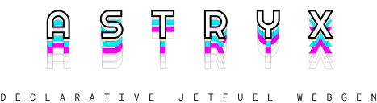

Astryx is yet another static web generator. *But this time it's totally different!* No, really.

Why?

- zero boilerplate
- declarative, safe, correct
- (optionally) single file script generates an entire site
- not specific to blogs, expressive enough for any applicable use case
